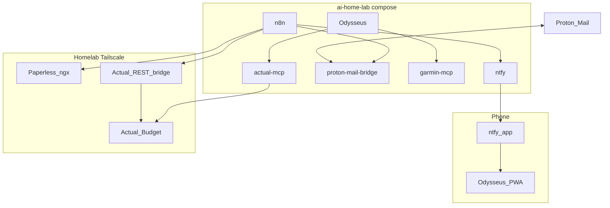

# AI Home Lab — System Design

Architecture and component boundaries. For execution, issues, and milestones see [PLAN.md](./PLAN.md). For setup see [README.md](../README.md).

---

## 1. Purpose

Build a single home lab stack where:

- **Deterministic work** runs unattended (sync, ingest, thresholds, notifications).
- **Interactive work** happens in one place when human judgment is required.
- **Domain logic** lives in MCP servers, not custom agents.
- **Workflow definitions** live in this repo (n8n JSON, Odysseus presets).

External services (Actual Budget, Paperless-ngx) run on the homelab outside this repo; this repo connects over Tailscale.

---

## 2. Principles

### Layering

| Layer | Tool | Role |
|-------|------|------|
| Orchestration | n8n | Cron, webhooks, if/else — *when* things run |
| Domain logic | MCP servers + external APIs | Deterministic data and operations |
| Judgment + chat | Odysseus | LLM, conversation, memory |
| Alerts | ntfy | One-way phone ping; reply in Odysseus |

### Odysseus vs n8n

| Question | Answer |
|----------|--------|
| Does a human need to decide or converse? | **Odysseus** (+ MCP tools) |
| Can the outcome be fully specified (if X then Y)? | **n8n** |
| Need attention on the phone? | **ntfy** → deep link to Odysseus |

Odysseus scheduled tasks are mostly LLM prompts on a cron. Preset automations belong in **n8n**. Use Odysseus cron only when open-ended reasoning is the product.

| Flow | n8n | Odysseus |
|------|-----|----------|
| Email attachment → Paperless | yes | no |
| Bank sync on schedule | yes | no |
| Envelope threshold → ntfy | yes | no |
| Categorize a transaction | no | yes |
| Weekly Garmin zone alert | yes | no |
| Coach conversation | no | yes |

### Networks

- **edge** — Odysseus, n8n, garmin-mcp, bridges; internal service discovery.
- **mcp-internal** — MCP servers; `internal: true`, not reachable from host.
- Expose only **Odysseus** and **ntfy** (Tailscale). Never publish MCP or model ports publicly.

---

## 3. Architecture



Solid lines: implemented or bundled today. Dashed components in the diagram are represented as planned services in §4.

---

<<<<<<< HEAD
## 4. Components
=======
## 4. Orchestration
>>>>>>> refs/remotes/Y/master

### Odysseus (implemented)

Self-hosted workspace ([upstream](https://github.com/pewdiepie-archdaemon/odysseus)). Vendored at `vendor/odysseus`.

- Chat, agents, memory, presets, MCP client.
- Bundles ChromaDB, SearXNG, ntfy in compose.
- Port `7000`. All **interactive** work happens here.
- Connects to MCP servers over SSE on the `edge` network.

<<<<<<< HEAD
=======
### n8n (planned)

Workflow orchestration in compose.

- Cron, webhooks, if/else, IMAP poll, HTTP to external APIs.
- Owns all **unattended** automation.
- Workflow JSON versioned under `workflows/n8n/` (planned).
- `garmin-mcp` speaks MCP/SSE only; n8n needs REST shim or HTTP bridge for Garmin data.

Odysseus can do cron and webhooks but lacks reliable branching; task webhooks target n8n by design.

## 5. MCP Servers

>>>>>>> refs/remotes/Y/master
### garmin-mcp (implemented)

MCP server for Garmin Connect (`src/mcp-servers/garmin-mcp`).

**Implemented today**

- Tools: `get_profile`, `get_activities`, `get_events`, `get_race_predictions`, `get_weekly_mileage`
- Resource: `garmin://weekly-report`
- Auth via `GARMIN_EMAIL` / `GARMIN_PASSWORD` in `.env`
- SSE on port 8000; hostname `garmin-mcp` on `edge` + `mcp-internal`

**Planned extensions**

<<<<<<< HEAD
- HR zone time per activity and weekly rollup
- Prompt resource `garmin://coach-prompt` (80/20 training rules)
- Profile tools: goals, injuries, preferences; variable `days_back` / `get_review_since`
- `garmin://health` with structured errors
- Workout create/schedule and nutrition suggestion tools
- REST shim (`/health`, `/weekly-report`) for n8n HTTP nodes

Coach instructions move to MCP prompt resource; Odysseus preset stays thin.
=======
##### Phase 1
- HR zone time per activity and weekly rollup
- Prompt resource `garmin://coach-prompt` (80/20 training rules)
  - Coach instructions move to MCP prompt resource; Odysseus preset stays thin.
- Make review variable
- Profile tools: goals, injuries, preferences
- `garmin://health` with structured errors
- Workout create/schedule and nutrition suggestion tools
  - Have a set of templates, where the agent would only need to fill in a few variables. Based on a generic fucntion. These templates could then be combined to create for example an easy + stride run.
  - Templates:
    - Recovery run
    - Easy run
    - Tempo run
    - Threshold run
    - Long run
    - Sprint Session
  - Scheduling of the workouts, should be part of the template.
- Nutration matrix
  - A way to build in messages into the workout for when to eat, or drink.

##### Phase 2 (more research required)
The science of running. In this phase I want to take out the "guessing" part of the couch, using funciton, and ml model, i believe that we can make a more predictable, and validated training plan. If we start on the the users goals, and the profile data, we can then draw a weekly distance curve. So the agent is not reacting from week to week, but each week is a prediction based on the previous weeks. If we know the distance that the user has run in the previous weeks, make a proposal for the next week. And then depending on how close we are to the goal, we can distribute that distance over a set of workouts. 

This could be a tool in the MCP server, that makes a proposal or prediction, and the agent can then use this to create a workout plan.

### actual-mcp (planned)

OSS MCP server for Actual Budget ([actual-mcp](https://github.com/s-stefanov/actual-mcp)). SSE in compose; points at external Actual server.

- Odysseus finance preset uses this for **interactive** clearing only.
- n8n uses REST bridge, not MCP.

## 6. Services
>>>>>>> refs/remotes/Y/master

### ntfy (implemented)

Bundled with Odysseus compose. One-way push to phone.

- n8n and scripts POST notifications; user taps action URL to open Odysseus.
- Not a chat channel.

<<<<<<< HEAD
### n8n (planned)

Workflow orchestration in compose.

- Cron, webhooks, if/else, IMAP poll, HTTP to external APIs.
- Owns all **unattended** automation.
- Workflow JSON versioned under `workflows/n8n/` (planned).
- `garmin-mcp` speaks MCP/SSE only; n8n needs REST shim or HTTP bridge for Garmin data.

Odysseus can do cron and webhooks but lacks reliable branching; task webhooks target n8n by design.

=======
>>>>>>> refs/remotes/Y/master
### Proton Mail Bridge (planned)

Headless IMAP/SMTP bridge to Proton Mail. Docker internal only (`edge`).

- n8n polls IMAP at `proton-mail-bridge:1143` (typical).
<<<<<<< HEAD
- Odysseus email/IMAP is **not** used for ingest (no duplicate polling).

### Paperless-ngx (external)

=======
- Odysseus email/IMAP is **not** used for ingest (no duplicate polling). (LETS TRY ANYWAY )

## 7. External Services

### Paperless-ngx
>>>>>>> refs/remotes/Y/master
Document store on homelab. Not in this repo.

- n8n posts attachments to `/api/documents/post_document/`.
- Flow: IMAP → filter PDF/images → Paperless → ntfy → mark read.

<<<<<<< HEAD
### Actual Budget (external)
=======
### Actual Budget
>>>>>>> refs/remotes/Y/master

Personal finance server on homelab. Local-first; **no native webhooks**.

- n8n polls via a REST bridge ([actual-budget-rest-api](https://github.com/zonemix/actual-budget-rest-api) or similar) for sync and envelope checks.
- Interactive categorization and transfers in Odysseus via actual-mcp.

**Design spike required before build** — open questions:

| # | Topic |
|---|--------|
| Q1 | Which REST bridge and n8n integration |
| Q2 | Sync frequency vs bank rate limits |
| Q3 | Definition of “needs clearing” |
| Q4 | Envelope field for “transfer from savings” |
| Q5 | Per-envelope thresholds config |
| Q6 | Notification dedupe / cooldown |
| Q7 | Odysseus finance preset deep-link context |
| Q8 | actual-mcp write confirmation rules |
| Q9 | Fixed-rule transfers in n8n vs always Odysseus |
| Q10 | Failure modes (server down, sync conflict) |

<<<<<<< HEAD
### actual-mcp (planned)

OSS MCP server for Actual Budget ([actual-mcp](https://github.com/s-stefanov/actual-mcp)). SSE in compose; points at external Actual server.

- Odysseus finance preset uses this for **interactive** clearing only.
- n8n uses REST bridge, not MCP.

=======
>>>>>>> refs/remotes/Y/master
### Legacy agents (retiring)

`agent_hub` (Chainlit) removed. `garmin_trainer` (LangGraph) remains until Odysseus Garmin preset is validated.

| Was | Now |
|-----|-----|
| Chainlit UI | Odysseus |
| LangGraph orchestration | Odysseus agent loop + MCP |
| Coach prompt in Python | MCP prompt resource (planned) |
| Agent-side MCP client | Odysseus native MCP |

Delete `src/agents/`, Chainlit/LangGraph deps, `.chainlit/` after cutover. See [PLAN.md](./PLAN.md) Track A.

<<<<<<< HEAD
=======
## 8. Tools

>>>>>>> refs/remotes/Y/master
### epub2audiobook (implemented)

Standalone Python tool under `src/tools/epub2audiobook`. Not part of the Docker stack. See [epub2audiobook.md](./epub2audiobook.md).

### workflows/ (planned)

```
workflows/
  n8n/          # exported workflow JSON
  odysseus/presets/
  config/       # envelope thresholds, env key map (no secrets)
```

Secrets in n8n credentials and `.env` only.

---

<<<<<<< HEAD
## 5. Security
=======
## 9. Security
>>>>>>> refs/remotes/Y/master

| Asset | Exposure |
|-------|----------|
| Odysseus, n8n admin | Tailscale or loopback; auth on |
| ntfy | Tailscale; unguessable topic names |
| Proton Mail Bridge | Docker internal only |
| MCP servers | `edge` / `mcp-internal` only |
| Actual / Paperless | Homelab Tailscale |
| actual-mcp write | Confirm in Odysseus preset |

---

<<<<<<< HEAD
## 6. Out of scope
=======
## 10. Out of scope
>>>>>>> refs/remotes/Y/master

| Item | Notes |
|------|-------|
| Hosting Actual or Paperless in this repo | External homelab |
| Odysseus email for ingest | n8n + Proton bridge |
| Telegram two-way chat | ntfy + Odysseus PWA for now |
| ADHD life aid | Future `adhd-mcp` or Odysseus notes |
| Forking Odysseus | Vendor clone (AGPL) |

---

<<<<<<< HEAD
## 7. References
=======
## 11. References
>>>>>>> refs/remotes/Y/master

- [Odysseus](https://github.com/pewdiepie-archdaemon/odysseus)
- [Actual Budget API](https://actualbudget.org/docs/api/)
- [actual-mcp](https://github.com/s-stefanov/actual-mcp)
- [Paperless-ngx API](https://github.com/paperless-ngx/paperless-ngx/blob/main/docs/api.md)
- [Proton Mail Bridge](https://proton.me/mail/bridge)
- [n8n](https://n8n.io/)
