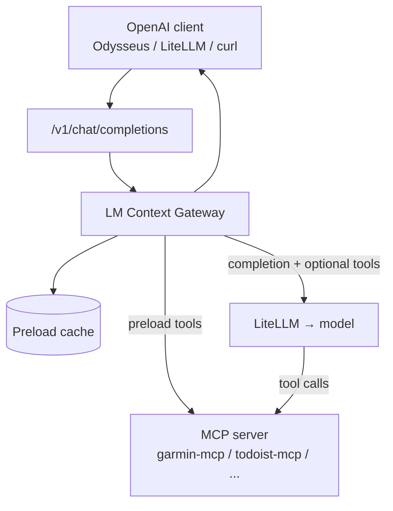

# LM Context Gateway — Design

**Status:** Draft / future work  
**Last updated:** 2026-07-01

A design for a small library and runtime that turns **deterministic MCP preloads + LLM narration** into an **OpenAI-compatible API endpoint**. Domain logic stays in MCP servers; orchestration of *when* and *how* context is injected moves out of general-purpose agents (Odysseus) and into a narrow, configurable gateway.

Garmin running coach is the intended **reference recipe**. Todoist, home automation, or email digests would be additional recipes using the same scaffolding.

Related today:

- [garmin-mcp](../src/mcp-servers/garmin-mcp/) — MCP server with `get_coaching_brief` (deterministic review + proposal)
- [garmin-mcp-tools.md](./garmin-mcp-tools.md) — current tool surface
- [DESIGN.md](./DESIGN.md) — home lab layering (Odysseus vs n8n vs MCP)

---

## 1. Problem

General agent UIs (Odysseus agent mode, etc.) are built for **open-ended tool selection**:

- Tool-RAG may miss the right MCP tool on a given turn.
- Short follow-ups can hit fast paths (e.g. low-signal replies) without tools or full context.
- Multi-step flows (`get_coach_prompt` → `get_weekly_review` → analyze) depend on model discipline.

**Langflow-style workflows** worked for Garmin because they **always fetched the same data first**, then let the LLM talk. The valuable pattern is not the UI—it is:

1. **Deterministic preload** from MCP (or REST).
2. **Inject** results into the model context.
3. **Optional** short tool loop for actions (schedule workout, create task).
4. Expose as a **normal chat API** so any client (Odysseus chat mode, LiteLLM, curl) can use it as “just another model.”

The LM Context Gateway formalizes that pattern as reusable infrastructure.

---

## 2. Goals

| Goal | Detail |
|------|--------|
| **Recipe-driven** | YAML/JSON manifest: MCP connection, preload tool calls, context template, LLM route, exposed model name. |
| **Deterministic preload** | Named MCP tools run in declared order before every completion (or on cache TTL). |
| **OpenAI-compatible surface** | `POST /v1/chat/completions`, optional streaming; `GET /v1/models` listing pseudo-models per recipe. |
| **LiteLLM as backend** | Gateway calls LiteLLM for the actual LLM; supports local and cloud models. |
| **MCP-native** | Primary integration via MCP (stdio or streamable HTTP); REST preload optional where MCP servers already expose it. |
| **Small scope** | Personal / homelab use; single user; not a no-code platform. |

## 3. Non-goals (v1)

- Replacing Odysseus or n8n globally.
- Visual workflow editor (Langflow/n8n territory).
- Hosting or training models.
- Multi-tenant auth, billing, or rate limiting beyond a simple API key.
- Arbitrary agent loops (cap tool rounds; preload is the main event).

---

## 4. Core concepts

| Term | Meaning |
|------|---------|
| **Gateway** | HTTP server speaking OpenAI Chat Completions; runs the preload → prompt → LLM pipeline. |
| **Recipe** | One configured domain (e.g. `garmin-coach`): MCP target, preload steps, templates, model id. |
| **Preload** | Fixed list of MCP tool invocations that run before the LLM sees the user message. |
| **Context bundle** | Merged JSON/text from preload results, rendered into system (or developer) message. |
| **Pseudo-model** | Client-visible model name (`garmin-coach`) mapping to a recipe, not weights on disk. |
| **Transform** | Optional post-processing of tool output (JSONPath, Jinja, or Python hook) before injection. |
| **Action tools** | Subset of MCP tools still offered to the LLM after preload (e.g. `create_*_workout`). |

---

## 5. Architecture



### Layers

```
┌─────────────────────────────────────────────┐
│  OpenAI API (FastAPI or LiteLLM plugin)      │
├─────────────────────────────────────────────┤
│  Gateway runtime — sessions, cache, stream   │
├─────────────────────────────────────────────┤
│  Context builder — templates, JSON paths       │
├─────────────────────────────────────────────┤
│  Preload executor — sequential/parallel MCP  │
├─────────────────────────────────────────────┤
│  MCP client (official SDK: stdio / HTTP)     │
└─────────────────────────────────────────────┘
              ▲
              │ recipe manifest (per domain)
```

**Domain logic** remains in MCP servers (e.g. `coaching_brief.py` inside garmin-mcp). The gateway does not interpret ACWR or training zones—it calls tools and injects JSON.

---

## 6. Request lifecycle

1. Client sends `POST /v1/chat/completions` with `model: garmin-coach` and `messages[]`.
2. Gateway resolves **recipe** by model name.
3. **Preload** (if cache miss or expired):
   - Connect to recipe’s MCP server.
   - Run each tool in `preload` list with fixed arguments.
   - Store results in session cache (keyed by recipe + optional user id).
4. **Context build**:
   - Render system prompt from template + preload payloads (and optional static files).
5. **LLM call** via LiteLLM:
   - Messages = system (injected context) + client `messages` (user/assistant history).
   - If recipe defines `action_tools`, attach tool schemas; allow up to `max_tool_rounds`.
6. **Response**:
   - Non-streaming: OpenAI `choices[0].message` JSON.
   - Streaming: SSE chunks compatible with OpenAI clients.

### Caching

| Strategy | Behavior |
|----------|----------|
| `preload_ttl` | Reuse preload JSON for N minutes; skip MCP on cache hit. |
| `refresh_on` | Optional keywords in latest user message force refresh (`refresh`, `latest data`). |
| Session | Conversation history from client; preload cache independent per recipe. |

Garmin Connect is slow; **30–60 minute TTL** is a reasonable default for coach recipes.

---

## 7. Recipe manifest (sketch)

Illustrative YAML—not implemented.

```yaml
apiVersion: lmcontextgateway/v1
kind: Recipe
metadata:
  name: garmin-coach
  description: Polarized running coach — week review and next-week proposal

spec:
  model:
    id: garmin-coach          # exposed in GET /v1/models
    display_name: Garmin Coach

  mcp:
    transport: streamable-http
    url: ${GARMIN_MCP_URL:-http://127.0.0.1:8000/mcp}
    # transport: stdio
    # command: uv run server.py

  preload:
    - id: brief
      tool: get_coaching_brief
      arguments:
        days_back: 7
      required: true

  context:
    system_template: |
      You are the user's Garmin running coach. Narrate the preloaded coaching
      brief clearly. Use real numbers from the JSON below. Polarized 80/20 only.
      Do not invent stats.

      ## Preloaded coaching brief
      {{ preload.brief | tojson(indent=2) }}

    # Optional: inject only slices instead of full JSON
    # inject:
    #   - path: preload.brief.coaching_brief.narrative
    #   - path: preload.brief.training_plan

  llm:
    provider: litellm
    model: ${COACH_LLM_MODEL:-openai/gpt-4o-mini}
    temperature: 0.4
    max_tokens: 4096

  action_tools:
  # Optional second phase — schedule on Garmin when user asks
    allow:
      - create_base_workout
      - create_recovery_workout
      - create_long_run_workout
      - create_threshold_workout
      - create_sprint_workout
      - schedule_workout
    max_rounds: 3

  cache:
    preload_ttl: 30m

  expose:
    enabled: true
```

### Manifest fields (reference)

| Field | Required | Purpose |
|-------|----------|---------|
| `model.id` | yes | Pseudo-model name for OpenAI clients |
| `mcp` | yes | Connection to MCP server |
| `preload[]` | yes | Deterministic tool calls before LLM |
| `context.system_template` | yes | Jinja2 (or similar) over preload + env |
| `llm` | yes | LiteLLM model id and generation params |
| `action_tools` | no | Tools exposed to LLM after preload |
| `cache` | no | Preload TTL and refresh rules |
| `transforms` | no | Named hooks for custom JSON shaping |

---

## 8. OpenAI API compatibility

### Endpoints (minimum)

| Method | Path | Notes |
|--------|------|-------|
| `POST` | `/v1/chat/completions` | Primary; supports `stream: true` |
| `GET` | `/v1/models` | Lists one entry per enabled recipe |
| `GET` | `/health` | Liveness; optional MCP reachability check |

### Request

Clients send standard OpenAI chat payloads. Gateway **ignores** client tool definitions for preload; recipe owns tool policy.

### Response

Match OpenAI shape: `id`, `object`, `created`, `model`, `choices[]`, `usage` (estimated if provider omits).

### LiteLLM registration

Homelab option: register gateway base URL in LiteLLM as a custom OpenAI-compatible provider so all UI traffic can route to `garmin-coach` without Odysseus agent mode.

---

## 9. MCP integration

### Transports

- **streamable-http** — matches current garmin-mcp deployment.
- **stdio** — spawn subprocess per recipe or pooled connection.

### Preload execution

- Default: **sequential** (order in manifest matters).
- Optional: `parallel: true` per group when tools are independent.
- **required: false** on a step — log warning, continue (for soft deps).
- **required: true** — fail request with structured error if tool errors.

### REST shortcut

If an MCP server exposes REST (e.g. garmin-mcp `GET /coaching-brief`), recipes may use `preload.http` instead of MCP for that step—same inject path. Keeps gateway usable when MCP session setup is heavy.

### Action tool loop

After first completion, if model returns tool calls and `action_tools` is set:

1. Execute via same MCP connection.
2. Append tool results to messages.
3. Call LiteLLM again until text reply or `max_rounds`.

Preload is **not** re-run on action rounds unless cache expired.

---

## 10. Security (homelab assumptions)

- Single user; API key on gateway env (`GATEWAY_API_KEY`).
- MCP credentials stay on MCP server (Garmin login), not in gateway.
- Gateway should not log full preload JSON by default (health data).
- Bind to tailnet or localhost unless explicitly exposed.

---

## 11. Reference recipe: Garmin coach

Maps to current ai-home-lab stack.

| Piece | Today | Gateway role |
|-------|-------|----------------|
| Data + deterministic proposal | `get_coaching_brief` in garmin-mcp | Single preload step |
| Week rows + narrative | `training_plan`, `coaching_brief` in response | Injected JSON |
| LLM | Odysseus agent + skill | LiteLLM via gateway |
| Schedule workouts | `create_*_workout` MCP tools | `action_tools` (optional) |
| Client | Odysseus agent mode + skill | Odysseus **chat mode** → `model: garmin-coach` |

**Odysseus skill becomes optional** when the gateway is the model endpoint.

### Future: Odysseus fork with “Generate agent”

A possible evolution—not required for v0—is a **forked Odysseus** (or companion UI) that does not patch upstream agent orchestration. Instead it offers something like **Generate agent**:

- User picks a **configured LLM** (from existing Odysseus/LiteLLM endpoints).
- User picks one or more **configured MCP servers**.
- User defines **preload tools** (deterministic calls) and optional **action tools**.
- The UI emits a **recipe manifest** and starts (or registers) an LM Context Gateway instance behind the scenes.

The chat experience is then a normal Odysseus conversation against the resulting **pseudo-model** (`garmin-coach`, `todoist-digest`, …), with preload handled by the gateway library—not by skills, tool-RAG, or low-signal fast paths.

This enhances Odysseus **by composition** (gateway as model endpoint + recipe builder) rather than by growing `agent_loop.py`. Upstream Odysseus stays untouched; the fork only adds recipe authoring and routes selected chats to gateway models.

---

## 12. Second recipe (sketch): Todoist digest

Validates generalization without Garmin-specific code in the library.

```yaml
metadata:
  name: todoist-digest
spec:
  model:
    id: todoist-digest
  mcp:
    transport: stdio
    command: todoist-mcp
  preload:
    - tool: list_tasks
      arguments: { filter: today | overdue }
    - tool: list_projects
  context:
    system_template: |
      Summarize today's tasks and suggest a focus order.
      {{ preload | tojson }}
  llm:
    model: openai/gpt-4o-mini
  action_tools:
    allow: [complete_task, reschedule_task]
    max_rounds: 2
```

Same gateway binary; different manifest file.

---

## 13. Comparison to existing tools

| Project | Overlap | Gap |
|---------|---------|-----|
| **Odysseus agent mode** | MCP tools, LiteLLM | General orchestration; no deterministic preload contract |
| **LiteLLM proxy** | OpenAI surface, custom handlers | No first-class recipe/preload/MCP manifest |
| **n8n / Langflow** | Deterministic steps + LLM | UI workflows; not a library; weak OpenAI model abstraction |
| **mcpo** | MCP exposure | OpenAPI tools only; no preload + LLM pipeline |
| **Dify / FastGPT** | App + API | Heavy platform; not MCP-first |

The niche: **declarative preload from MCP + pseudo-model OpenAI API + thin LiteLLM backend.**

---

## 14. Proposed repository layout (future)

Option A — package inside ai-home-lab until mature:

```
src/lm-context-gateway/
  lmcontextgateway/
    api/          # FastAPI OpenAI routes
    preload/      # MCP executor, cache
    context/      # Templates, JSONPath
    llm/          # LiteLLM wrapper
    recipe/       # Manifest loader + validation
  recipes/
    garmin-coach.yaml
  tests/
```

Option B — separate repo when second recipe lands; ai-home-lab keeps `recipes/garmin-coach.yaml` and depends on published package.

---

## 15. Roadmap

| Phase | Deliverable | Success criterion |
|-------|-------------|-------------------|
| **0 — Design** | This document | Shared understanding |
| **1 — Garmin v0** | Single FastAPI app, hardcoded garmin preload, no library split | Odysseus chat mode calls `garmin-coach` and returns full review + proposal |
| **2 — Manifest** | YAML loader + one schema | Change preload/model without code edits |
| **3 — Extract library** | `lmcontextgateway` package | Second recipe (Todoist or mock) in &lt;50 lines YAML |
| **4 — Polish** | Streaming, cache TTL, action_tools loop | Production-comfortable for daily coach use |
| **5 — Optional** | LiteLLM custom provider plugin | Register gateway as native LiteLLM backend |

**Do not start with the library.** Build Phase 1 against garmin-mcp; note every hardcoded line that would move into the package.

---

## 16. Open questions

1. **Always preload vs intent routing** — Full brief every message (Langflow-like) vs classify user intent first? Default: always preload with TTL; routing as optional recipe feature.
2. **Where transforms live** — Heavy logic in MCP (`coaching_brief`) vs gateway Jinja vs Python plugins? Prefer MCP for domain rules; gateway for presentation.
3. **Streaming + preload latency** — Emit status events (`preloading…`) before tokens? Or block until preload completes?
4. **Multi-recipe routing** — One gateway process per recipe or one process, many models? Prefer one process, many recipes on `/v1/models`.
5. **Name** — Working title: **LM Context Gateway** (`lm-context-gateway`, import `lmcontextgateway`). Alternatives: MCP Context Gateway, RecipeLLM.

---

## 17. Relationship to ai-home-lab principles

From [DESIGN.md](./DESIGN.md):

- **Domain logic in MCP** — unchanged; gateway never replaces garmin-mcp.
- **Odysseus for judgment + chat** — Odysseus becomes a client of a specialist pseudo-model when domain is narrow; general agent remains for open-ended work.
- **n8n for cron/if-else** — n8n can still ping ntfy or trigger gateway via HTTP for scheduled “weekly review” messages without chat UI.

The gateway is a **new layer** between “MCP domain servers” and “LLM clients”:

```
n8n (when) → optional
Odysseus / apps (chat UI) → LM Context Gateway (preload + API) → MCP servers (data)
                                                          → LiteLLM (narration)
```

---

## 18. Next steps (when prioritised)

1. Spike Phase 1: FastAPI + `get_coaching_brief` via MCP HTTP + one LiteLLM call + OpenAI JSON response.
2. Point Odysseus preset at gateway URL in **chat mode**; validate no agent/tools needed.
3. Document env vars and docker-compose service next to garmin-mcp.
4. Revisit manifest schema after spike pain points.
5. Consider upstream OSS if the abstraction stabilises and others want the same pattern.

---

*This document is intentionally implementation-free. Update it when Phase 1 spike learns something that changes the manifest or API shape.*
