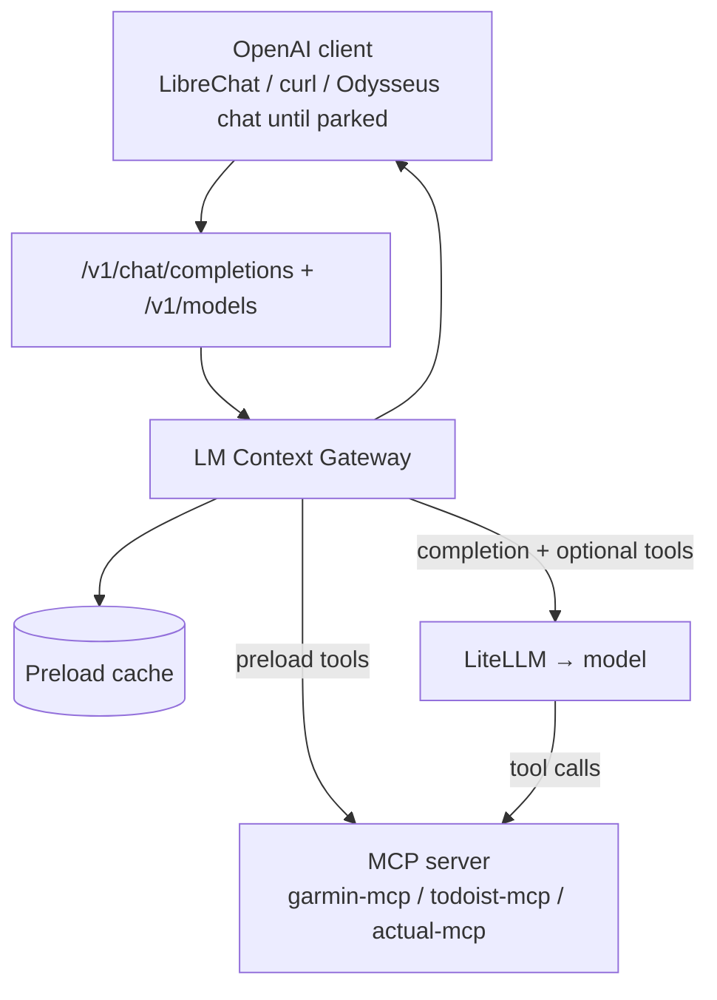

# LM Context Gateway — Design

**Status:** Draft / future work (not part of the current Nix / home-manager cutover)  
**Last updated:** 2026-08-14

A design for a small library and runtime that turns **deterministic MCP preloads + LLM narration** into an **OpenAI-compatible API endpoint**. Domain logic stays in MCP servers; orchestration of *when* and *how* context is injected moves out of general-purpose agents (Odysseus) and into a narrow, configurable gateway.

Garmin running coach is the intended **reference recipe**. Todoist, Actual, or email digests would be additional recipes using the same scaffolding.

Related today:

- [garmin-mcp](../src/mcp-servers/garmin-mcp/) — MCP server with `get_coaching_brief` (deterministic review + proposal)
- [garmin-mcp-tools.md](./garmin-mcp-tools.md) — current tool surface
- [DESIGN.md](./DESIGN.md) — home lab layering (Odysseus vs n8n vs MCP)

---

## 0. Decision (Odysseus replacement, 2026-08-14)

Do **not** swap Odysseus for one mega-app. The gap is not “another chat UI.” It is an **agent-writable catalog**: Cursor (and other agents) must be able to add Garmin, Todoist, Actual, or a new MCP by editing git, after which the phone/PWA discovers a new capability with **no Admin clicks**.

Odysseus can already attach MCP servers. Attachment lives in Admin UI → SQLite (`app.db`) and JSON under the data volume. Recreate the container and the rows are gone. Agents cannot fill that form. Cursor already has the other kind of dynamic via `mcp.json`. The homelab GUI does not.

**LM Context Gateway is the shape that fixes that:**

1. Point the GUI at **one** OpenAI-compatible endpoint, once.
2. Recipes in git become entries on `GET /v1/models` (`garmin-coach`, `todoist-digest`, `actual-review`, …).
3. An agent adding a capability is a YAML file + apply — not an Admin row.
4. The GUI only **selects a model**. It never grows MCP URL rows.

That is dynamic for the UI (new capabilities appear) and static for ops (git / Nix is the source of truth).

### Two kinds of “dynamic MCP”

| Kind | Who updates it | What the GUI does |
| --- | --- | --- |
| Odysseus Admin MCP rows | Human in the PWA | Stores URLs in `app.db`. Recreate the volume and it is gone. Agents cannot fill the form. |
| Gateway recipes → `/v1/models` | Agent commits YAML (or Nix copies it in) | GUI already has one custom endpoint. New recipe shows up as a model to pick. |
| LibreChat `librechat.yaml` MCP list | Agent edits YAML + restart | GUI grows a tool list. Better than Admin, but every new MCP is still a **client-side attach** — not one endpoint forever. |

LibreChat is the closest git-friendly Odysseus-like UI. Use it as a **client of the gateway**, not as the place that accumulates MCP URLs. Open WebUI’s MCP Admin is the same class of problem as Odysseus. Do not fork Odysseus (AGPL vendor clone; DESIGN.md out of scope). Wrapping Odysseus in Nix houses the container; it does not fix agent semantics or config drift.

### What to keep vs park

| Keep | Drop or park |
| --- | --- |
| garmin-mcp, actual-mcp, todoist-mcp, `docs/skills` | Odysseus **agent mode** + tool-RAG as the coach |
| LiteLLM as the model router | Wiring models only in Odysseus Admin |
| n8n for unattended flows (cron, Proton→Paperless, bank sync, ntfy) | Langflow as the Garmin path (already the lesson) |
| Gateway recipes in git | OpenClaw as the primary replacement (optional later sidecar) |

Until this layer is built, Odysseus stays the GUI and MCP servers stay the domain layer. homelab-nix apply, home-manager, and Paperless are a **different track**.

### Target architecture

Split “chat app” from “what the model is allowed to do.” That is already the layering in DESIGN.md. The missing piece is a git-owned runtime between LiteLLM and MCP.

| Layer | Owns | Lives in |
| --- | --- | --- |
| Nix flake / compose | Containers, networks, secrets, Homepage | homelab-nix |
| MCP servers | Garmin / Actual / Todoist domain logic | `src/mcp-servers` (keep) |
| LiteLLM | Which weights / cloud routes | Existing `:4000` (cut over to Nix later) |
| **LM Context Gateway** | Recipes: preload, prompt, action-tool allowlist, pseudo-model name | New service; YAML in git |
| Chat UI (LibreChat later) | Conversation, memory, phone-usable UI | New Nix-managed container; **one** custom endpoint |
| n8n | Cron, webhooks, if/else | Already Nix-managed |

A Garmin turn: client sends `model: garmin-coach` to the gateway. Gateway always calls `get_coaching_brief` on garmin-mcp, injects JSON into the system prompt, then optionally allows a short action-tool loop (`create_*_workout`). LiteLLM only sees a normal chat completion. The model cannot “forget” the brief. Same pattern for `todoist-digest` and `actual-review`.

Suggested cutover when this *is* prioritised: (1) gateway + `garmin-coach` on `homelab-mcp`, (2) LibreChat pointed at that one endpoint, (3) more recipes, (4) park Odysseus compose (restic snapshot of `app.db`; do not delete until coach + Actual chat feel right).

---

## 1. Problem

General agent UIs (Odysseus agent mode, Open WebUI MCP Admin, etc.) are built for **open-ended tool selection** *and* store that selection in a GUI database:

- Tool-RAG may miss the right MCP tool on a given turn (Garmin coaching misses `get_coaching_brief`).
- Short follow-ups can hit fast paths (e.g. low-signal replies) without tools or full context.
- Multi-step flows (`get_coach_prompt` → `get_weekly_review` → analyze) depend on model discipline.
- MCP servers, model endpoints, and presets live in SQLite/JSON under the data volume — not in git. Agents cannot update them.

**Langflow-style workflows** worked for Garmin because they **always fetched the same data first**, then let the LLM talk. The valuable pattern is not the UI—it is:

1. **Deterministic preload** from MCP (or REST).
2. **Inject** results into the model context.
3. **Optional** short tool loop for actions (schedule workout, create task).
4. Expose as a **normal chat API** so any client (LibreChat, Odysseus chat mode until parked, LiteLLM, curl) can use it as “just another model.”

The LM Context Gateway formalizes that pattern as reusable infrastructure **and** as the agent-writable catalog (recipe files → `/v1/models`).

---

## 2. Goals

| Goal | Detail |
|------|--------|
| **Recipe-driven** | YAML/JSON manifest: MCP connection, preload tool calls, context template, LLM route, exposed model name. |
| **Agent-writable catalog** | Adding a recipe file is how an agent attaches a domain. GUI config does not grow. |
| **Deterministic preload** | Named MCP tools run in declared order before every completion (or on cache TTL). |
| **OpenAI-compatible surface** | `POST /v1/chat/completions`, optional streaming; `GET /v1/models` listing pseudo-models per recipe. |
| **LiteLLM as backend** | Gateway calls LiteLLM for the actual LLM; supports local and cloud models. |
| **MCP-native** | Primary integration via MCP (stdio or streamable HTTP); REST preload optional where MCP servers already expose it. |
| **Small scope** | Personal / homelab use; single user; not a no-code platform. |

## 3. Non-goals (v1)

- Replacing Odysseus or n8n globally, or swapping Odysseus for one mega-app.
- Forking Odysseus (AGPL; DESIGN.md out of scope) or growing `agent_loop.py`.
- Teaching Odysseus a config API so agents can POST Admin MCP rows.
- Visual workflow editor (Langflow/n8n territory).
- Hosting or training models.
- Multi-tenant auth, billing, or rate limiting beyond a simple API key.
- Arbitrary agent loops (cap tool rounds; preload is the main event).
- The current Nix cutover (containers, home-manager, Paperless). Build this when agents should add models instead of Admin rows.

---

## 4. Core concepts

| Term | Meaning |
|------|---------|
| **Gateway** | HTTP server speaking OpenAI Chat Completions; runs the preload → prompt → LLM pipeline. |
| **Recipe** | One configured domain (e.g. `garmin-coach`): MCP target, preload steps, templates, model id. |
| **Preload** | Fixed list of MCP tool invocations that run before the LLM sees the user message. |
| **Context bundle** | Merged JSON/text from preload results, rendered into system (or developer) message. |
| **Pseudo-model** | Client-visible model name (`garmin-coach`) mapping to a recipe, not weights on disk. |
| **Catalog** | `GET /v1/models` — one entry per enabled recipe. This is what the GUI lists. |
| **Transform** | Optional post-processing of tool output (JSONPath, Jinja, or Python hook) before injection. |
| **Action tools** | Subset of MCP tools still offered to the LLM after preload (e.g. `create_*_workout`). |

---

## 5. Architecture



### Layers

```
┌─────────────────────────────────────────────┐
│  OpenAI API (FastAPI or LiteLLM plugin)      │
├─────────────────────────────────────────────┤
│  Gateway runtime — sessions, cache, stream   │
├─────────────────────────────────────────────┤
│  Context builder — templates, JSON paths       │
├─────────────────────────────────────────────┤
│  Preload executor — sequential/parallel MCP  │
├─────────────────────────────────────────────┤
│  MCP client (official SDK: stdio / HTTP)     │
└─────────────────────────────────────────────┘
              ▲
              │ recipe manifest (per domain, in git)
```

**Domain logic** remains in MCP servers (e.g. `coaching_brief.py` inside garmin-mcp). The gateway does not interpret ACWR or training zones—it calls tools and injects JSON.

The chat UI is **not** in this box. It is a client that already knows one base URL. New recipes do not require a GUI config change.

---

## 6. Request lifecycle

1. Client sends `POST /v1/chat/completions` with `model: garmin-coach` and `messages[]`.
2. Gateway resolves **recipe** by model name.
3. **Preload** (if cache miss or expired):
   - Connect to recipe’s MCP server.
   - Run each tool in `preload` list with fixed arguments.
   - Store results in session cache (keyed by recipe + optional user id).
4. **Context build**:
   - Render system prompt from template + preload payloads (and optional static files).
5. **LLM call** via LiteLLM:
   - Messages = system (injected context) + client `messages` (user/assistant history).
   - If recipe defines `action_tools`, attach tool schemas; allow up to `max_tool_rounds`.
6. **Response**:
   - Non-streaming: OpenAI `choices[0].message` JSON.
   - Streaming: SSE chunks compatible with OpenAI clients.

### Caching

| Strategy | Behavior |
|----------|----------|
| `preload_ttl` | Reuse preload JSON for N minutes; skip MCP on cache hit. |
| `refresh_on` | Optional keywords in latest user message force refresh (`refresh`, `latest data`). |
| Session | Conversation history from the client; preload cache independent per recipe. |

Garmin Connect is slow; **30–60 minute TTL** is a reasonable default for coach recipes.

---

## 7. Recipe manifest (sketch)

Illustrative YAML—not implemented.

```yaml
apiVersion: lmcontextgateway/v1
kind: Recipe
metadata:
  name: garmin-coach
  description: Polarized running coach — week review and next-week proposal

spec:
  model:
    id: garmin-coach          # exposed in GET /v1/models
    display_name: Garmin Coach

  mcp:
    transport: streamable-http
    url: ${GARMIN_MCP_URL:-http://127.0.0.1:8000/mcp}
    # transport: stdio
    # command: uv run server.py

  preload:
    - id: brief
      tool: get_coaching_brief
      arguments:
        days_back: 7
      required: true

  context:
    system_template: |
      You are the user's Garmin running coach. Narrate the preloaded coaching
      brief clearly. Use real numbers from the JSON below. Polarized 80/20 only.
      Do not invent stats.

      ## Preloaded coaching brief
      {{ preload.brief | tojson(indent=2) }}

    # Optional: inject only slices instead of full JSON
    # inject:
    #   - path: preload.brief.coaching_brief.narrative
    #   - path: preload.brief.training_plan

  llm:
    provider: litellm
    model: ${COACH_LLM_MODEL:-openai/gpt-4o-mini}
    temperature: 0.4
    max_tokens: 4096

  action_tools:
  # Optional second phase — schedule on Garmin when user asks
    allow:
      - create_base_workout
      - create_recovery_workout
      - create_long_run_workout
      - create_threshold_workout
      - create_sprint_workout
      - schedule_workout
    max_rounds: 3

  cache:
    preload_ttl: 30m

  expose:
    enabled: true
```

### Manifest fields (reference)

| Field | Required | Purpose |
|-------|----------|---------|
| `model.id` | yes | Pseudo-model name for OpenAI clients |
| `mcp` | yes | Connection to MCP server |
| `preload[]` | yes | Deterministic tool calls before LLM |
| `context.system_template` | yes | Jinja2 (or similar) over preload + env |
| `llm` | yes | LiteLLM model id and generation params |
| `action_tools` | no | Tools exposed to LLM after preload |
| `cache` | no | Preload TTL and refresh rules |
| `transforms` | no | Named hooks for custom JSON shaping |

---

## 8. OpenAI API compatibility

### Endpoints (minimum)

| Method | Path | Notes |
|--------|------|-------|
| `POST` | `/v1/chat/completions` | Primary; supports `stream: true` |
| `GET` | `/v1/models` | **Catalog:** one entry per enabled recipe. This is how the GUI stays one-endpoint. |
| `GET` | `/health` | Liveness; optional MCP reachability check |

### Request

Clients send standard OpenAI chat payloads. Gateway **ignores** client tool definitions for preload; recipe owns tool policy.

### Response

Match OpenAI shape: `id`, `object`, `created`, `model`, `choices[]`, `usage` (estimated if provider omits).

### LiteLLM registration

Homelab option: register gateway base URL in LiteLLM as a custom OpenAI-compatible provider so all UI traffic can route to `garmin-coach` without Odysseus agent mode. Prefer the GUI talking to the gateway directly so `/v1/models` is the catalog the user picks from.

---

## 9. MCP integration

### Transports

- **streamable-http** — matches current garmin-mcp deployment.
- **stdio** — spawn subprocess per recipe or pooled connection.

### Preload execution

- Default: **sequential** (order in manifest matters).
- Optional: `parallel: true` per group when tools are independent.
- **required: false** on a step — log warning, continue (for soft deps).
- **required: true** — fail request with structured error if tool errors.

### REST shortcut

If an MCP server exposes REST (e.g. garmin-mcp `GET /coaching-brief`), recipes may use `preload.http` instead of MCP for that step—same inject path. Keeps gateway usable when MCP session setup is heavy.

### Action tool loop

After first completion, if model returns tool calls and `action_tools` is set:

1. Execute via same MCP connection.
2. Append tool results to messages.
3. Call LiteLLM again until text reply or `max_rounds`.

Preload is **not** re-run on action rounds unless cache expired.

---

## 10. Security (homelab assumptions)

- Single user; API key on gateway env (`GATEWAY_API_KEY`).
- MCP credentials stay on MCP server (Garmin login), not in gateway.
- Gateway should not log full preload JSON by default (health data).
- Bind to the `homelab` / `homelab-mcp` Docker networks or Tailscale; do not publish MCP or the gateway publicly.

---

## 11. Reference recipe: Garmin coach

Maps to current ai-home-lab stack.

| Piece | Today | Gateway role |
|-------|-------|----------------|
| Data + deterministic proposal | `get_coaching_brief` in garmin-mcp | Single preload step |
| Week rows + narrative | `training_plan`, `coaching_brief` in response | Injected JSON |
| LLM | Odysseus agent + skill | LiteLLM via gateway |
| Schedule workouts | `create_*_workout` MCP tools | `action_tools` (optional) |
| Client | Odysseus agent mode + skill | Any OpenAI client → `model: garmin-coach` (LibreChat later; Odysseus **chat mode** as interim) |

Odysseus **skills become optional** when the gateway is the model endpoint. Do not rely on agent mode or tool-RAG to remember `get_coaching_brief`.

### GUI is a client, not a recipe builder

An earlier sketch was a forked Odysseus “Generate agent” UI that emitted recipes. **Do not do that.** Forking Odysseus is out of scope (AGPL). Recipe authoring belongs in git (agents edit YAML). The GUI only lists `/v1/models` and chats. LibreChat (or curl, or Odysseus chat mode until parked) is the client.

---

## 12. Further recipes (sketches)

Validates generalization without Garmin-specific code in the library. Same gateway binary; different manifest files.

### Todoist digest

```yaml
metadata:
  name: todoist-digest
spec:
  model:
    id: todoist-digest
  mcp:
    transport: streamable-http
    url: ${TODOIST_MCP_URL:-http://todoist-mcp:3001/mcp}
  preload:
    - tool: list_tasks
      arguments: { filter: today | overdue }
    - tool: list_projects
  context:
    system_template: |
      Summarize today's tasks and suggest a focus order.
      {{ preload | tojson }}
  llm:
    model: openai/gpt-4o-mini
  action_tools:
    allow: [complete_task, reschedule_task]
    max_rounds: 2
```

### Actual review

Same pattern against actual-mcp (preload balances / transactions, optional write tools behind `action_tools`). Model id `actual-review`. Domain rules stay in the MCP server.

---

## 13. Comparison to existing tools

Scores below are for **this lab** (git/Nix as source of truth, native MCP, usable chat, homelab ops) — not general popularity.

| Project | Overlap | Gap / verdict |
|---------|---------|----------------|
| **LM Context Gateway (this design)** | Recipes, preload, `/v1/models` | API only. **Build this.** Chat UI is a separate client. |
| **LibreChat** | Chat UI; MCP in `librechat.yaml` | Best Odysseus-like UI. Point it at the gateway; do not make it the MCP catalog. |
| **Odysseus agent mode** | MCP tools, LiteLLM | GUI/SQLite catalog; no deterministic preload; tool-RAG misses Garmin tools. |
| **Odysseus Nix-wrapped** | Same PWA | Houses the container; does not fix semantics or config drift. |
| **Open WebUI** | Polished chat | MCP is Admin Panel — same class of problem as Odysseus. |
| **OpenClaw** | JSON MCP client | Already on disk; not Nix-native by default; deferred as primary replacement. |
| **Block Goose / HF tiny-agents** | File-based agents | Strong for scripts; weak phone/PWA. |
| **LiteLLM proxy** | OpenAI surface, custom handlers | No first-class recipe/preload/MCP manifest. Keep as the weight router. |
| **n8n AI Agent + MCP Client** | Cron + tools | Keep n8n for unattended if/else. Do not make it the chat workspace. |
| **Langflow / Dify / AnythingLLM / Letta** | App + LLM | Canvas or DB is the source of truth. |
| **mcpo** | MCP exposure | OpenAPI tools only; no preload + LLM pipeline. |
| **Fork Odysseus** | Familiar UI | Out of scope (AGPL vendor clone). |

The niche: **declarative preload from MCP + pseudo-model OpenAI API + thin LiteLLM backend + git as the catalog.**

---

## 14. Proposed repository layout (future)

Option A — package inside ai-home-lab until mature:

```
src/lm-context-gateway/
  lmcontextgateway/
    api/          # FastAPI OpenAI routes
    preload/      # MCP executor, cache
    context/      # Templates, JSONPath
    llm/          # LiteLLM wrapper
    recipe/       # Manifest loader + validation
  recipes/
    garmin-coach.yaml
    todoist-digest.yaml
    actual-review.yaml
  tests/
```

Nix (homelab-nix) would run this as a managed container on `homelab-mcp` when this track starts. Recipe files stay in git so `nix run .#apply` (or a dedicated gateway apply) is how an agent publishes a new model.

Option B — separate repo when a second recipe lands; ai-home-lab keeps the YAML and depends on a published package.

---

## 15. Roadmap

| Phase | Deliverable | Success criterion |
|-------|-------------|-------------------|
| **0 — Design** | This document | Shared understanding (including the 2026-08-14 catalog decision) |
| **1 — Garmin v0** | Single FastAPI app, hardcoded garmin preload, no library split | `curl` (then LibreChat or Odysseus chat mode) calls `garmin-coach` and returns full review + proposal |
| **2 — Manifest** | YAML loader + one schema | Change preload/model without code edits; `/v1/models` lists the recipe |
| **3 — Extract library** | `lmcontextgateway` package | Second recipe (Todoist or Actual) in &lt;50 lines YAML |
| **4 — Polish** | Streaming, cache TTL, action_tools loop | Production-comfortable for daily coach use |
| **5 — UI client** | LibreChat (or equivalent) with **one** custom endpoint | GUI picks `garmin-coach` from the model list; no Admin MCP rows |
| **6 — Optional** | LiteLLM custom provider plugin | Register gateway as native LiteLLM backend |
| **7 — Park Odysseus** | Stop Odysseus compose; restic snapshot of `app.db` | Coach + Actual chat feel right |

**Do not start with the library.** Build Phase 1 against garmin-mcp; note every hardcoded line that would move into the package.

**Do not start this as part of the Nix OS/home-manager/Paperless cutover.**

---

## 16. Open questions

1. **Always preload vs intent routing** — Full brief every message (Langflow-like) vs classify user intent first? Default: always preload with TTL; routing as optional recipe feature.
2. **Where transforms live** — Heavy logic in MCP (`coaching_brief`) vs gateway Jinja vs Python plugins? Prefer MCP for domain rules; gateway for presentation.
3. **Streaming + preload latency** — Emit status events (`preloading…`) before tokens? Or block until preload completes?
4. **Multi-recipe routing** — One gateway process per recipe or one process, many models? Prefer one process, many recipes on `/v1/models`.
5. **Name** — Working title: **LM Context Gateway** (`lm-context-gateway`, import `lmcontextgateway`). Alternatives: MCP Context Gateway, RecipeLLM.
6. **Interim client** — Keep Odysseus chat mode pointed at the gateway until LibreChat exists, or skip the PWA and use curl/Homepage first?

---

## 17. Relationship to ai-home-lab principles

From [DESIGN.md](./DESIGN.md), updated by the 2026-08-14 review:

- **Domain logic in MCP** — unchanged; gateway never replaces garmin-mcp / actual-mcp / todoist-mcp.
- **Chat UI for judgment** — Odysseus today; LibreChat (or similar) later as a client of specialist pseudo-models. General open-ended agent work is not the Garmin/Actual path.
- **n8n for cron/if-else** — n8n can still ping ntfy or trigger the gateway via HTTP for scheduled “weekly review” messages without a chat UI.
- **Git / Nix as source of truth** — recipes are files. Apply publishes them. GUI databases are not the catalog.

The gateway is a **new layer** between “MCP domain servers” and “LLM clients”:

```
n8n (when) → optional
LibreChat / Odysseus chat / curl  →  LM Context Gateway (preload + /v1/models)
                                      → MCP servers (data)
                                      → LiteLLM (narration)
```

---

## 18. Next steps (when prioritised)

1. Spike Phase 1: FastAPI + `get_coaching_brief` via MCP HTTP + one LiteLLM call + OpenAI JSON response.
2. Confirm `GET /v1/models` lists `garmin-coach` so a GUI can pick it with no MCP config.
3. Point a client (curl first, then LibreChat or Odysseus **chat mode**) at the gateway; validate no agent/tools needed.
4. Document env vars and a Nix-managed compose service on `homelab-mcp`.
5. Add `todoist-digest` / `actual-review` as YAML once the loader exists.
6. Revisit manifest schema after spike pain points.
7. Park Odysseus only after coach + Actual chat feel right; keep a restic snapshot of `app.db`.

---

*This document is intentionally implementation-free. Update it when Phase 1 spike learns something that changes the manifest or API shape.*
