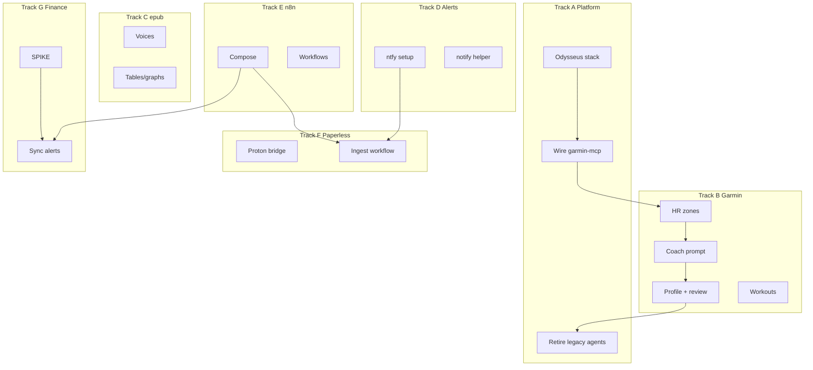

# AI Home Lab — Execution Plan

Checklists, milestones, and GitHub issues. Architecture: [DESIGN.md](./DESIGN.md). Setup: [README.md](../README.md).

---

## Status

| Area | State |
|------|-------|
| Odysseus + compose | Implemented |
| garmin-mcp core tools | Implemented |
| Chainlit `agent_hub` | Removed |
| `garmin_trainer` | Retiring (A.6) |
| ntfy | Bundled; mobile setup open (Track D) |
| n8n, Proton bridge, actual-mcp | Planned |
| epub2audiobook | Implemented; #1 #2 open |

---

## Execution tracks



---

## Track A — Platform (M1)

| Step | Issue | Work | Done when |
|------|-------|------|-----------|
| A.1 | done | `ensure-odysseus.sh` + `docker compose up` | Odysseus healthy on `:7000` |
| A.2 | new | Odysseus MCP → `http://garmin-mcp:8000/sse` | Tools + weekly report visible |
| A.3 | new | LiteLLM / models in Odysseus | Coach preset replies |
| A.4 | new | `garmin://health` MCP resource | Actionable error messages |
| A.5 | new | Garmin Coach Odysseus preset | Usable without `garmin_trainer` |
| A.6 | new | Remove `src/agents/`, Chainlit/LangGraph | Legacy agents gone |

---

## Track B — Garmin coach (M2)

| Step | Issue | Work | Done when |
|------|-------|------|-----------|
| B.1 | [#3](https://github.com/MichielSaey/ai-home-lab/issues/3) | HR zones in weekly report | Per-activity + weekly rollup |
| B.2 | [#4](https://github.com/MichielSaey/ai-home-lab/issues/4) | `garmin://coach-prompt` (80/20 rules) | Prompt resource in MCP |
| B.3 | new | Profile + variable review tools | goals, preferences, `days_back` |
| B.4 | new | Workout + nutrition tools | Structured create/schedule |
| B.5 | new | REST shim on garmin-mcp | n8n can HTTP fetch report/health |

#4 depends on #3.

---

## Track C — epub2audiobook (M3)

| Step | Issue | Work | Done when |
|------|-------|------|-----------|
| C.1 | [#1](https://github.com/MichielSaey/ai-home-lab/issues/1) | Dynamic voices — list, `--voice`, batch random | Voices selectable per run |
| C.2 | [#2](https://github.com/MichielSaey/ai-home-lab/issues/2) | Tables/graphs → ebook reference in TTS | No verbatim table readout |

See [epub2audiobook.md](./epub2audiobook.md).

---

## Track D — Notifications (M4)

| Step | Issue | Work | Done when |
|------|-------|------|-----------|
| D.1 | new | ntfy Tailscale + phone app | Test ping received |
| D.2 | new | `src/shared/notify.py` | Scripts can notify |
| D.3 | new | ntfy action → Odysseus deep link | Tap opens preset |
| D.4 | new | Weekly review → ntfy | Proactive coach ping |

---

## Track E — n8n orchestration (M5)

| Step | Issue | Work | Done when |
|------|-------|------|-----------|
| E.1 | new | n8n service in `docker-compose.yml` | n8n running in compose |
| E.2 | new | `workflows/` scaffold + `scripts/n8n-import.sh` | JSON workflows in repo |
| E.3 | new | Garmin zone threshold workflow | Cron → zones → ntfy (needs B.1, B.5) |
| E.4 | new | Pipeline/deploy webhook → ntfy | CI/pipeline alerts on phone |

---

## Track F — Mail + Paperless (M6)

Depends on Track D and Track E.

| Step | Issue | Work | Done when |
|------|-------|------|-----------|
| F.1 | new | Proton Mail Bridge in compose + n8n IMAP test | n8n reads mail via bridge |
| F.2 | new | Email → Paperless → ntfy workflow | Attachments filed unattended |

---

## Track G — Actual Budget (M7)

Do not start G.1–G.4 until G.0 is complete.

| Step | Issue | Work | Done when |
|------|-------|------|-----------|
| G.0 | new | SPIKE — answer [DESIGN §4](DESIGN.md#actual-budget-external) Q1–Q10; document REST bridge | Written decisions + bridge URL/auth |
| G.1 | new | n8n sync + uncategorized alert | ntfy → Odysseus finance link |
| G.2 | new | n8n envelope transfer reminders | Threshold → ntfy ping |
| G.3 | new | actual-mcp in compose + Odysseus wire-up | Finance MCP tools in Odysseus |
| G.4 | new | Odysseus finance preset | Interactive clearing via chat |

---

## Recommended order

```text
Track A (A.1–A.5)     Odysseus + garmin usable
Track D               ntfy first
Track E.1–E.2         n8n scaffold
Track B (#3, #4)      Garmin MCP depth
Track C (#1, #2)      epub (parallel)
Track F               Paperless
Track G.0             Finance SPIKE
Track G.1–G.4         Finance build
Track A.6             Retire legacy agents
```

---

## Definition of done

- [ ] Odysseus is the only agent UI; garmin-mcp is the Garmin surface
- [ ] ntfy alerts with Odysseus deep links (Track D)
- [ ] n8n workflows in repo (Track E)
- [ ] Issues #1–#4 closed
- [ ] Paperless ingest unattended (Track F)
- [ ] Finance SPIKE done before finance automation (Track G)
- [ ] Legacy agent code removed (Track A.6)

---

## New issue templates

Short bodies for rows marked `new` above.

**A.2** — Add garmin-mcp SSE URL in Odysseus admin; verify tools and `garmin://weekly-report`.

**A.3** — Point Odysseus at LiteLLM proxy; verify coach preset responds.

**A.4** — `garmin://health` or `check_connection`; structured errors for outage/missing creds.

**A.5** — Garmin Coach preset; enable garmin-mcp tools/resources.

**A.6** — Remove `src/agents/`, Chainlit deps, `.chainlit/` after preset validated.

**B.3** — `get_training_profile` / `set_training_profile`; `days_back` / `get_review_since`.

**B.4** — Workout templates + `create_workout` / `schedule_workout` + nutrition matrix.

**B.5** — `GET /health`, `GET /weekly-report` HTTP routes for n8n.

**D.1–D.3** — ntfy Tailscale, `notify.py`, deep links to Odysseus presets.

**E.1–E.2** — n8n in compose; `workflows/` + import script.

**F.1–F.2** — Proton bridge container; Paperless ingest workflow.

**G.0** — Answer DESIGN Actual Q1–Q10 before any finance automation code.

**G.3–G.4** — actual-mcp service; finance preset for interactive clearing only.
